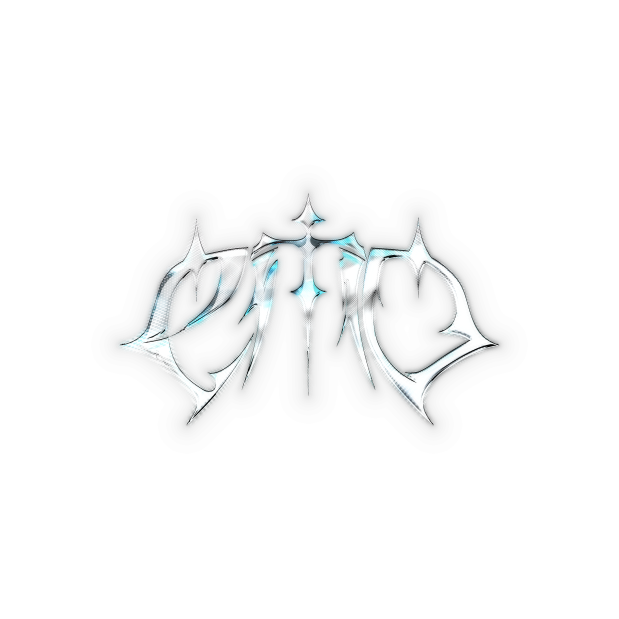

# ⚔️ EMO CLXN — GTA 5 RP CAPT FAMILY PORTAL

<p align="center">
  
</p>

<h3 align="center">EMO CLXN // SECTOR: BURTON DOMINANCE // EST. 2023</h3>

<p align="center">
  
  
  
  
</p>

<p align="center">
  <b>🇬🇧 <a href="#-about">English</a></b> &nbsp;|&nbsp; <b>🇷🇺 <a href="#-о-проекте-ru">Русский</a></b>
</p>

---

## 🇬🇧 About

**EMO CLXN** is the official promo site for **EMO CLXN**, a "capt" (capture) faction / crew on a **GTA 5 RP** roleplay server (Burton), running across **Majestic RP, RageMP and Alt:V**. It's a fan/community portal — not a game mod or plugin — built to look and feel like a tactical HUD: dark gothic aesthetic, liquid-chrome text, Y2K glitch touches, and a custom crosshair cursor.

There is no backend. It's a static site (plain HTML/CSS/JS) hosted on GitHub Pages, meant to be the crew's public face: who they are, what they've achieved on the server, and how to join.

### What a visitor sees

- **Boot sequence** — a startup loader with in-character "capt slang" status lines before the page reveals itself.
- **Intro / Hero** — the EMO CLXN shield logo, animated chrome title, and a mission-style tagline.
- **Stats dashboard** — animated counters (roster size, years active, win rate) that count up on scroll.
- **"Сотка" (The Hundred)** — a showcase of the crew's 86/86 business takeover on the Burton server, with a zoomable screenshot and a scrolling ticker of member nicknames.
- **Emo Spring Redux** — a promo card for the crew's custom GTA graphics/FPS redux, linking to a YouTube overview.
- **Contacts** — cards linking out to the crew's Discord and YouTube.
- **How to join** — a call-to-action pointing to the Discord ticket channel.
- **`soon.html`** — a standalone "coming soon" placeholder page for a section still in development.

### Interactive extras

- Custom crosshair-style cursor that snaps into a "target lock" state over clickable elements.
- Lazy-loaded YouTube lightbox for the archive video (nothing loads until you click play).
- Click-to-copy Discord handle with an on-screen toast notification.
- Scroll-based auto-hiding header, scroll-progress spine, and section reveal/stagger animations.
- Light/dark theme toggle persisted via `localStorage`.
- Canvas-based floating particle background.
- Full SEO pass: JSON-LD (`SportsOrganization`) schema, OpenGraph/Twitter cards, `robots.txt`, `sitemap.xml`, and a `site.webmanifest` for PWA-style install/icons.

### Tech stack

Plain, dependency-free front end — no framework, no build step:

- **HTML5** — `index.html`, `soon.html`
- **CSS3** — `css/style.css` (custom properties, animations, glassmorphism/chrome effects)
- **Vanilla JavaScript** — `js/scrypt.js` (DOM/scroll effects, canvas particles, lightbox, counters, theming)
- **Google Fonts** (Outfit, Syne, Orbitron, Pirata One, JetBrains Mono, etc.) and **Google Analytics (gtag.js)**

### Project structure

```
emoclxn/
├── assets/                          # Logo, GIF background, screenshots
│   ├── image.png                    # Main shield logo
│   ├── emo-clxn-logo.png            # Favicon / touch icon
│   ├── emoshapes-ezgif.com-optimize.gif
│   ├── gta5rp.png
│   ├── gta_map_tactical.png
│   ├── photo_2026-05-05_18-30-24.jpg
│   └── sotka_screenshot.png
├── css/
│   └── style.css                    # All styling & animation
├── js/
│   └── scrypt.js                    # Interactivity & effects
├── index.html                       # Main landing page
├── soon.html                        # "Coming soon" placeholder page
├── robots.txt                       # Crawler rules
├── sitemap.xml                      # Sitemap for Google/Yandex
├── site.webmanifest                 # PWA manifest
├── CNAME                            # Custom domain for GitHub Pages
└── README.md
```

### Run it locally

No build tools, no dependencies — it's static HTML.

```bash
git clone https://github.com/aferapokitaysky/emoclxn.git
cd emoclxn
```

Then either:

- Open `index.html` directly in a browser, **or**
- Serve it locally so relative paths/fonts behave the same as in production:

```bash
python3 -m http.server 8000
# then visit http://localhost:8000
```

### Credits

- **Production**: `PROD BY PTRKXLORD`
- **Discord contact**: `aferapokitaisky`

---

## 🇷🇺 О проекте (RU)

**EMO CLXN** — официальный промо-сайт капт-фамы **EMO CLXN** на сервере **GTA 5 RP** (Burton), работающей на **Majestic RP, RageMP и Alt:V**. Это фан/комьюнити-портал, а не мод или плагин к игре — визитная карточка состава: кто они, чего добились на сервере и как вступить.

Сайт полностью статический (чистые HTML/CSS/JS), без бэкенда, размещён на GitHub Pages. Оформление — тёмная готика, жидкий хром, глитч-эффекты Y2K и кастомный курсор-прицел.

### Что видит посетитель

- **Загрузочный экран** — стартовый лоадер со сленговыми каптерскими статусами перед появлением сайта.
- **Интро** — щит-логотип EMO CLXN, анимированный хромовый заголовок и слоган.
- **Дашборд статистики** — анимированные счётчики (состав, годы в каптах, винрейт), считающие при скролле.
- **«Сотка»** — витрина захвата 86/86 бизнесов на сервере Burton, с увеличиваемым скриншотом и бегущей строкой никнеймов состава.
- **Emo Spring Redux** — промо-карточка фирменного графического/FPS-редукса со ссылкой на обзор на YouTube.
- **Контакты** — карточки со ссылками на Discord и YouTube семьи.
- **Как вступить** — призыв к действию со ссылкой на канал создания тикета в Discord.
- **`soon.html`** — отдельная страница-заглушка «скоро» для раздела, который ещё в разработке.

### Интерактив

- Кастомный курсор-прицел, переключающийся в режим «захвата цели» над кликабельными элементами.
- Лайтбокс с ленивой загрузкой YouTube-видео архива (ничего не грузится до клика на плей).
- Копирование Discord-ника по клику с всплывающим уведомлением.
- Смарт-шапка, скрывающаяся при скролле, индикатор прогресса скролла и плавные анимации появления секций.
- Переключатель светлой/тёмной темы с сохранением в `localStorage`.
- Фоновые частицы на `<canvas>`.
- Глубокая SEO-настройка: JSON-LD-разметка (`SportsOrganization`), OpenGraph/Twitter-карточки, `robots.txt`, `sitemap.xml` и `site.webmanifest` для PWA-иконок.

### Технологии

Чистый фронтенд без зависимостей и сборки:

- **HTML5** — `index.html`, `soon.html`
- **CSS3** — `css/style.css` (кастомные свойства, анимации, стеклянные/хромовые эффекты)
- **Vanilla JavaScript** — `js/scrypt.js` (скролл-эффекты, частицы на canvas, лайтбокс, счётчики, темизация)
- **Google Fonts** (Outfit, Syne, Orbitron, Pirata One, JetBrains Mono и др.) и **Google Analytics (gtag.js)**

### Структура проекта

```
emoclxn/
├── assets/                          # Логотип, GIF-фон, скриншоты
├── css/style.css                    # Стили и анимации
├── js/scrypt.js                     # Интерактив и эффекты
├── index.html                       # Главная страница
├── soon.html                        # Страница-заглушка "скоро"
├── robots.txt                       # Правила для поисковых роботов
├── sitemap.xml                      # Карта сайта
├── site.webmanifest                 # PWA-манифест
├── CNAME                            # Домен для GitHub Pages
└── README.md
```

### Локальный запуск

Инструменты сборки не нужны — сайт полностью статический.

```bash
git clone https://github.com/aferapokitaysky/emoclxn.git
cd emoclxn
```

Затем откройте `index.html` в браузере, либо поднимите локальный сервер (чтобы шрифты и относительные пути работали как в проде):

```bash
python3 -m http.server 8000
# затем откройте http://localhost:8000
```

### Разработка

- **Продакшн**: `PROD BY PTRKXLORD`
- **Discord**: `aferapokitaisky`

---

<p align="center">
  <i>EMO CLXN // WE CONTROL THE GHETTO // SHOOT TO KILL // SHADOWPLAY IS ALWAYS ON</i>
</p>
